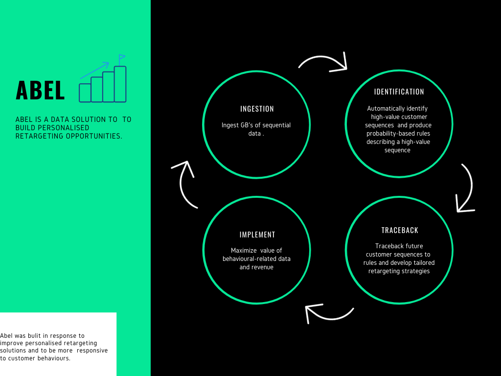

# Project Name : Abel - Using sequential data to offer personalised retargeting opportunities.

### How to use this ##
1) Ingest data in BQ_Regression.R (preferably more than 50k observations)
2) Tune Hyperparameters  (AR support and confidence could also try tuning high value clustering to your requirements)
3) Build Logistic Model 
4) Use Traceback to get results, to build a retargeting strategy 

## Future Updates(TBC)
1) Automatic Definition of Support/Confidence Levels
2) Functionality for Multi Support Thresholds if required
3) ~Model selection over more classification models(maybe try ensembling/stacking as a method to get high levels of  predictive power~
4) Front-End Development( for simplicity)(Django Web App with User Authentication)
5) Deep Learning Prediction of New Sequences ?
6) Automatic Recommendation of Retargeting Strategy ?
7) Add more behavioural parameters to the sequence .
8) Automatic Collection of Data  via external source
9) Add lagged effect of campagin activity (might influence campagian activity) ?
10) Add support for negative association rules
